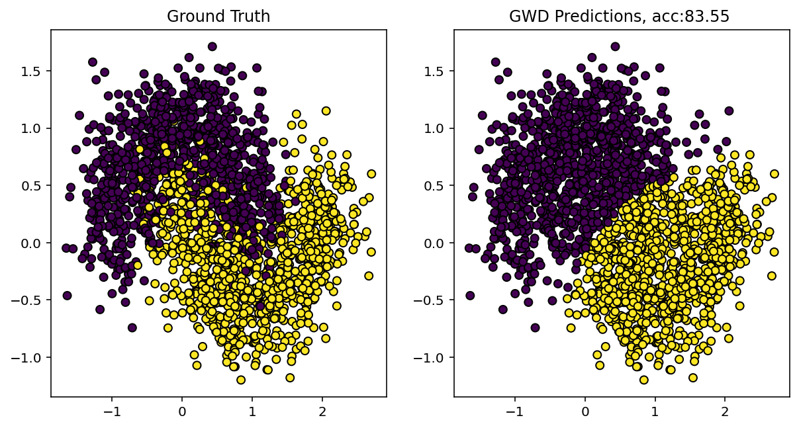
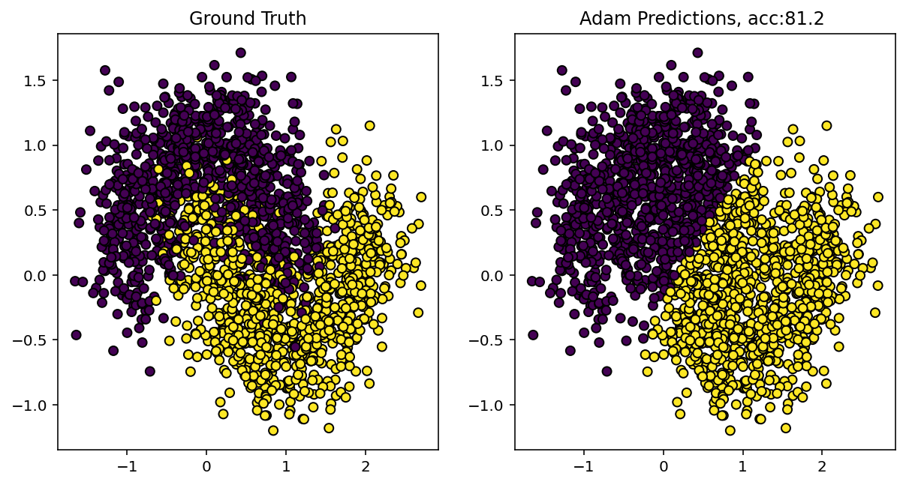
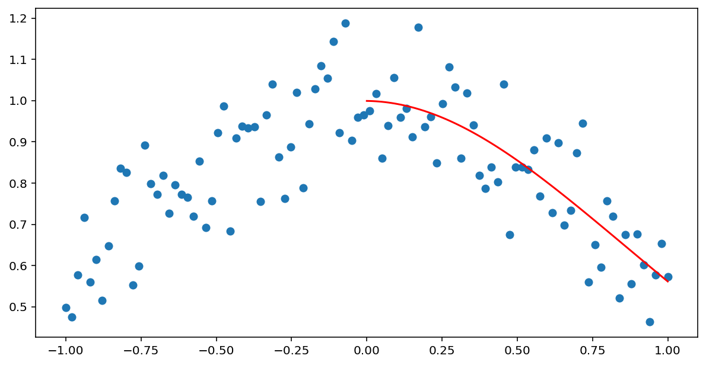

# MetaLearning


## Benchmark : Classification 
### Iris, Wine & Breast Cancer

```md
Layers = [LinearCfg(self.n_features, 16, nn.ReLU), LinearCfg(16, self.output_dim, None)  ]
model = neuro_opt.search_weights(optimizer_name=algo_choice, epochs=30, population=20)
====================================================================================================
Benchmarks
====================================================================================================
      Dataset Algorithm  Accuracy (%)  Train Time (s)  Latency (ms)  Params (k)  FLOPs (M)
         Iris      Adam         93.33            0.04        0.0652        0.13     0.0001
         Wine      Adam        100.00            0.05        0.0701        0.28     0.0003
Breast Cancer      Adam         98.25            0.04        0.0752        0.53     0.0005
         Iris       GWO        100.00            0.74        0.0552        0.13     0.0001
         Wine       GWO         94.44            0.71        0.0500        0.28     0.0003
Breast Cancer       GWO         97.37            0.80        0.0501        0.53     0.0005
         Iris       PSO         90.00            0.79        0.0500        0.13     0.0001
         Wine       PSO         83.33            0.56        0.0451        0.28     0.0003
Breast Cancer       PSO         92.11            0.69        0.0551        0.53     0.0005
         Iris        DE         96.67            0.82        0.0652        0.13     0.0001
         Wine        DE         91.67            0.79        0.0712        0.28     0.0003
Breast Cancer        DE         92.98            1.41        0.0703        0.53     0.0005
         Iris       WOA         93.33            0.59        0.0752        0.13     0.0001
         Wine       WOA         94.44            0.59        0.0804        0.28     0.0003
Breast Cancer       WOA         96.49            0.64        0.0451        0.53     0.0005
         Iris        GA        100.00            0.66        0.0516        0.13     0.0001
         Wine        GA        100.00            0.84        0.0700        0.28     0.0003
Breast Cancer        GA         96.49            0.83        0.0651        0.53     0.0005
         Iris       ABC         86.67            1.29        0.0451        0.13     0.0001
         Wine       ABC         91.67            1.36        0.0900        0.28     0.0003
Breast Cancer       ABC         94.74            1.88        0.0853        0.53     0.0005
         Iris       SMO         96.67            1.52        0.0600        0.13     0.0001
         Wine       SMO         91.67            1.24        0.0500        0.28     0.0003
Breast Cancer       SMO         96.49            1.41        0.0400        0.53     0.0005
         Iris       SMA         93.33            2.56        0.0653        0.13     0.0001
         Wine       SMA         91.67            9.16        0.0951        0.28     0.0003
Breast Cancer       SMA         83.33            7.81        0.0361        0.53     0.0005
         Iris       HHO         90.00            0.95        0.0551        0.13     0.0001
         Wine       HHO         80.56            0.96        0.0801        0.28     0.0003
Breast Cancer       HHO         94.74            1.33        0.0801        0.53     0.0005
====================================================================================================
```

```md

model = neuro_opt.search_model(optimizer_name_weights=algo_choice, epochs=30)
====================================================================================================
Benchmarks
====================================================================================================
      Dataset Algorithm  Accuracy (%)  Train Time (s)  Latency (ms)  Params (k)  FLOPs (M)
         Iris      Adam        100.00            0.60        0.1403        5.81     0.0057
         Wine      Adam        100.00            0.38        0.0601        1.75     0.0017
Breast Cancer      Adam         98.25            0.31        0.0500        1.52     0.0015
         Iris       GWO        100.00            9.33        0.0752        1.32     0.0012
         Wine       GWO        100.00            8.76        0.0702        0.79     0.0007
Breast Cancer       GWO         97.37            3.64        0.0350        0.53     0.0005
         Iris       PSO         96.67           10.75        0.0652        0.51     0.0005
         Wine       PSO         94.44            9.51        0.0811        1.23     0.0012
Breast Cancer       PSO         97.37           15.65        0.0651        5.17     0.0051
         Iris        DE         96.67            5.61        0.0451        0.19     0.0002
         Wine        DE         94.44            3.70        0.0351        0.09     0.0001
Breast Cancer        DE         97.37            6.90        0.0752        2.12     0.0021
         Iris       WOA         96.67            3.37        0.0500        0.16     0.0001
         Wine       WOA         88.89            3.08        0.0400        0.17     0.0002
Breast Cancer       WOA         92.98           10.04        0.1051        2.72     0.0026
         Iris        GA         96.67            3.97        0.0551        0.15     0.0001
         Wine        GA         91.67            7.45        0.0801        0.67     0.0006
Breast Cancer        GA         95.61            7.85        0.0351        0.53     0.0005
         Iris       ABC         96.67            8.71        0.0551        0.13     0.0001
         Wine       ABC         97.22            9.77        0.0501        0.70     0.0007
Breast Cancer       ABC         96.49           10.79        0.0502        1.42     0.0014
         Iris       SMO         96.67           17.23        0.0601        1.30     0.0012
         Wine       SMO         94.44           11.62        0.0502        0.19     0.0002
Breast Cancer       SMO         96.49           12.82        0.0400        0.96     0.0009
         Iris       SMA        100.00          169.17        0.0601        0.71     0.0007
         Wine       SMA         97.22          190.23        0.0500        0.26     0.0002
Breast Cancer       SMA         96.49          165.34        0.0451        0.30     0.0003
         Iris       HHO         93.33            7.78        0.0451        0.13     0.0001
         Wine       HHO         88.89            8.97        0.0451        0.28     0.0003
Breast Cancer       HHO         96.49            7.70        0.0700        0.53     0.0005
====================================================================================================
```

### make_moons (n=2000, noise=0.3) | 20 Runs Average
```python
X, y = make_moons(n_samples=2000, noise=0.3)
neuro_opt = NeuroOptimizer(X, y, task="classification")

model = neuro_opt.search_model(
    optimizer_name_weights=opt, 
    epochs=5,                   
    train_time=60,             
    epochs_weights=10,          
    population_weights=20,              
)
```
```md
====================================================================================================
ALGORITHM       | AVG ACCURACY    | STD DEV    | AVG INF TIME (ms)    | BEST ACC  
----------------------------------------------------------------------------------------------------
GWO             |   87.28%        | ±1.49%   |     0.2502 ms        |  89.95%
WOA             |   86.48%        | ±1.35%   |     0.5262 ms        |  90.15%
PSO             |   86.29%        | ±1.41%   |     0.2500 ms        |  88.75%
DE              |   86.06%        | ±1.49%   |     0.3985 ms        |  89.95%
SMO             |   85.78%        | ±1.37%   |     0.3003 ms        |  89.80%
ABC             |   85.78%        | ±1.03%   |     0.2485 ms        |  87.55%
HHO             |   85.04%        | ±1.57%   |     0.4988 ms        |  88.80%
GA              |   85.01%        | ±1.97%   |     0.3985 ms        |  89.40%
SMA             |   84.79%        | ±2.12%   |     0.6004 ms        |  89.25%
Adam            |   83.88%        | ±1.87%   |     0.3001 ms        |  88.05%
====================================================================================================
```
```python
model = neuro_opt.search_model(
    optimizer_name_weights=opt, 
    epochs=10,                   
    train_time=60,             
    epochs_weights=10,          
    population_weights=20, 
   
)
```
```md
====================================================================================================
ALGORITHM       | AVG ACCURACY    | STD DEV    | AVG INF TIME (ms)    | BEST ACC  
----------------------------------------------------------------------------------------------------
GWO             |   88.32%        | ±1.28%   |     0.8899 ms        |  91.05%
PSO             |   87.51%        | ±1.19%   |     0.7262 ms        |  89.80%
SMO             |   87.00%        | ±1.45%   |     0.6778 ms        |  90.30%
ABC             |   86.96%        | ±0.90%   |     0.4767 ms        |  88.85%
GA              |   86.84%        | ±1.21%   |     0.4511 ms        |  89.35%
DE              |   86.78%        | ±1.42%   |     0.6773 ms        |  89.45%
WOA             |   86.27%        | ±1.64%   |     1.7371 ms        |  89.70%
HHO             |   85.86%        | ±1.31%   |     0.6460 ms        |  88.90%
SMA             |   85.37%        | ±1.85%   |     0.6266 ms        |  88.65%
Adam            |   84.99%        | ±1.00%   |     0.6017 ms        |  87.05%
====================================================================================================

```

```python
neuro_opt = NeuroOptimizer(X, y, task="classification")
model=neuro_opt.search_model(optimizer_name_weights='Adam', epochs=20,  train_time=60,
                                epochs_weights=20, population_weights=20,
                                time_importance=time_importance)
```



## Benchmark : Regression

cos(x)+gauss(0,0.1)
```python
x = torch.linspace(-1, 1, 100).unsqueeze(1)
y = torch.cos( x) + torch.randn(100,1)*0.1

xtest= torch.linspace(0, 1, 100).unsqueeze(1)

Layers = [
    LinearCfg(1, 32, nn.Tanh),
    LinearCfg(32, 32, nn.Tanh),
    LinearCfg(32, 1, None)
]
neuro_opt = NeuroOptimizer(x, y, task="regression", Layers=Layers, activation=nn.Tanh)
model = neuro_opt.search_model(optimizer_name_weights='Adam', epochs=50,  train_time=10*60,
                                epochs_weights=200, population_weights=20,
                                verbose=True)
with torch.no_grad():
    pred = model(xtest)

```
